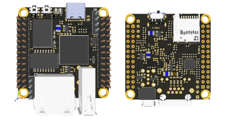
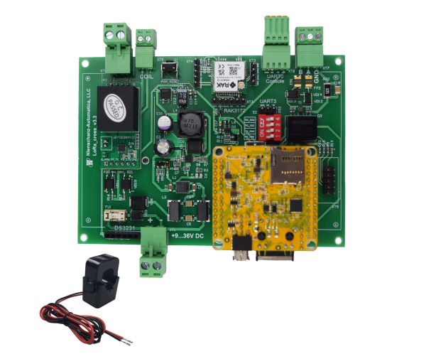
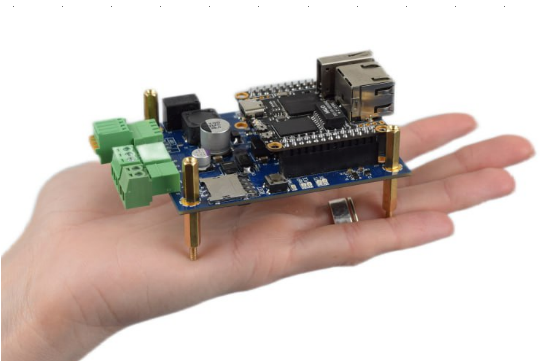
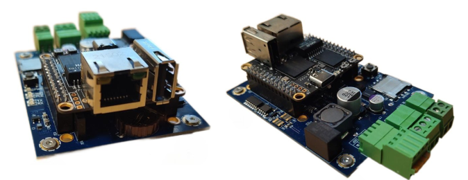
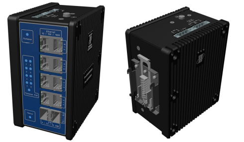

# Руководства и схемы продуктов NAPI и FrontControl

- [Руководства и схемы продуктов NAPI и FrontControl](#руководства-и-схемы-продуктов-napi-и-frontcontrol)
  - [Процессорный модуль NAPI](#процессорный-модуль-napi)
  - [FrontControl NAPI Current Collector (Токо-сборщик)](#frontcontrol-napi-current-collector-токо-сборщик)
  - [FrontControl Collector NG (Cборщик-компакт)](#frontcontrol-collector-ng-cборщик-компакт)
  - [FrontNet FN-8pSFP+/10G (промышленный коммутатор L2)](#frontnet-fn-8psfp10g-промышленный-коммутатор-l2)

## Процессорный модуль NAPI

Процессорный модуль на основе мощного ARM процессора Rockchip RK3308. Имеет 512Мб ОЗУ и 4Гб NAND Flash, 1хEthernet, 2xUSB? слот для SD-карты. Разработан как основа для создания различных встраиваемых устройств (ПЛК, системы сбора, системы контроля и передачи данных). Имеет малые размеры (43х43мм), малое энергопотребление, не требует активного охлаждения. Наличие портов (Ethernet, USB, PоE)
позволяет быстро прототипировать и создавать самые разные устройства на основе модуля.  Поставляется с ОС NapiLinux - встраиваемый вариант ОС Linux с резервированием (также поддерживается Ubutu, Debian, DietPi). Примеры устройств на основе NAPI: [Токо-сборщик](#frontcontrol-napi-current-collector-токо-сборщик), [Сборщик-компакт](#frontcontrol-collector-ng-cборщик-компакт), ПЛК "Наутилус".

[Guide: Руководство по процессорному модулю NAPI на русском языке](./readmeNapi.md)

[Guide: Прошивка NAPI Linux (и других ОС) из ОС Windows](./napi-extra/napi-win-flash.md)

[Links: Ссылки на прошивки и бутлоадеры](./napi-extra/napi-links.md)

## FrontControl NAPI Current Collector (Токо-сборщик)

«Токо-сборщик» - дешевая и практичная система сбора данных параметров однофазной сети (все в одном устройстве). Предназначена для сбора параметров потребителя (ток, напряжение, мощность, реактивная мощность и другие параметры).Применяется для анализа работы электро-установок (станки, печи, двигатели, вентиляторы), для своевременного 
технического обслуживания, минимизации времени простоя. Поддерживает хранение и анализ данных на устройстве и передачу данных через Ethernet\LoraWan сети.
Производится в различных вариантах корпусирования 
(пластик, металл). Имеется Веб интерфейс для настройки сетей и система визуализации данных с датчика.

:point_up: Работает на NAPI, совместим с NapiLinux. 

:boom: Принимаем заказы на реализацию подобных устройств с другими датчиками "на борту".

[Guide: Руководство на русском языке](./readmeNapiFrontControl.md)

## FrontControl Collector NG (Cборщик-компакт)

"Сборщик-компакт" - недорогое универсальное устройство для сбора данных с датчиков. Позволяет хранить, анализировать данные прямо на устройстве, а также осуществляет передачу данных через различные сети. Наличие слота PCI-E позволяет использовать различные модули передачи данных (модемы) и передавать данные по сетям LTE, LoraWan, Zigbee. Сбор датчиков осуществляется через изолированный порт RS485 или через Ethernet. Обладает компактными размерами, питается через БП 9-36в или через POE. Имеется RTC модуль (часы реального времени), слот для SIM, реле сухого контакта для реализации шлейфа сигнализации. 

:point_up: Работает на NAPI, совместим с NapiLinux. 

[Guide: Руководство на русском языке](./frontcontrolcompact.md)

## FrontNet FN-8pSFP+/10G (промышленный коммутатор L2)

Промышленный коммутатор FRONT Net - 
управляемый коммутатор с 8х1Гб портами 
и 2х10Гб портами, функцией PоE, 
с шлейфом управления сигнализацией. 
Питание 9-36В не требует сертификации, компактные
размеры позволяют располагать устройство в 
телекоммуникационных шкафах. поставляется с подробной инструкцией и Веб интерфесом на русском языке. Размер 141х124х70мм. Отлично подходит для сбора данных с Видео-камер высокого разрешения и передачи видео-потоков в дата-центры.

[Guide: Руководство на русском языке](./frontnet-l2.md)

