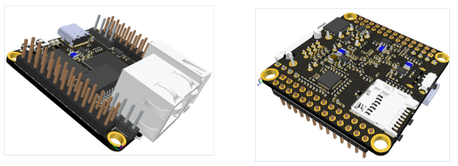

# Руковоства и схемы продуктов Front-xxx

# HandBook of Front-xxx products

## NAPI GPIO and NAPI Linux guide 

[Guide: Руководство на русском языке](./readmeNapi.md)

[Скоро: Как собрать NAPI Linux в системе YOCTO из исходных кодов](./soon.md)

## FrontControl NAPI Current Collector (Токо-сборщик)

[Guide: Руководство на русском языке](./readmeNapiFrontControl.md)

## FrontControl Collector NG (Cборщик компакт)

[Guide: Руководство на русском языке](./frontcontrolcompact.md)

## FrontNet FN-8pSFP+/10G (промышленный коммутатор L2)

[Guide: Руководство на русском языке](./frontnet-l2.md)

