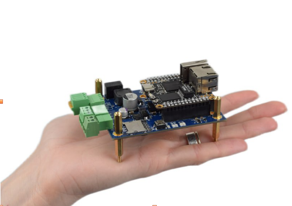
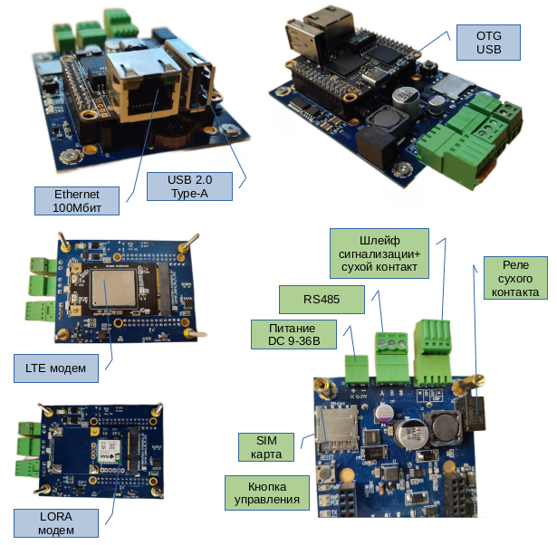

# FrontControl Collector Compact (Сборщик-компакт)

Сборщик-компакт — система сбора, хранения и передачи данных через LTE\LORA\Ethernet сети на основе процессорного модуля NAPI



## Особенности платы
- SOM: Napi - 4-х ядерный ARM процессор, 512MB ОЗУ, 4GB ПЗУ (NAND)
- RS485 изолированный порт для подключения датчиков
- Ethernet 100 Mbit
- PCI-E слот для LTE модема или LORA модуля
- Питание 9-36 или POE
- RTC (часы реального времени)
- Программное обеспечение: [NapiLinux](./napilinux.md) *), Ubuntu, DietPI
- Веб интерфейс для NapiLinux. Настройка сети, Lora, протокола Modbus RTU\TCP
  



## Программное обеспечение

Рекомендуем использовать [NapiLinux](./napilinux.md). В NapiLinux из коробки будет доступен [Веб-интерфейс](https://github.com/dmnovikov/napiguide/blob/main/readmeNapiFrontControl.md#веб-интерфейс) для настройки сети, настройки Lora,
настройки датчиков для опроса через Modbus (rtu\tcp) а также мониторинг запущенных сервисов и свободного места. 

## Доступность портов в системе NapiLinux

:point_up: /dev/ttyS0 - консоль ввода\вывода
Порт используется для отладки через TTL-USB устройство

```
Параметры порта:
115200,8,n,1
```

:point_up: /dev/ttyS3 - порт 485
Порт используется для подключения датчиков с интерфейсом RS485

```
Параметры порта задаются подключаемым датчиком
```

## Настройка модема LTE

....скоро будет
