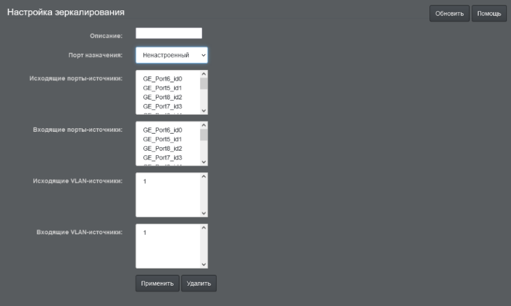

# Коммутатор FRONT NET

## Содержание

- [Коммутатор FRONT NET](#коммутатор-front-net)
  - [Содержание](#содержание)
  - [Презентация в PDF](#презентация-в-pdf)
  - [Основные функциональные узлы коммутатора](#основные-функциональные-узлы-коммутатора)
  - [Технические характеристики коммутатора FN-8pSFP+/10G](#технические-характеристики-коммутатора-fn-8psfp10g)
    - [Строгая спецификация по вариантам моделей](#строгая-спецификация-по-вариантам-моделей)
  - [Передняя панель коммутатора](#передняя-панель-коммутатора)
  - [Задняя панель коммутатора](#задняя-панель-коммутатора)
  - [Дополнительные достоинства коммутатора](#дополнительные-достоинства-коммутатора)
  - [Полностью русскоязычный Веб- интерфейс](#полностью-русскоязычный-веб--интерфейс)
    - [Общие настройки](#общие-настройки)
    - [Настройка POE](#настройка-poe)
    - [Настройка портов](#настройка-портов)
    - [Настройка VLAN](#настройка-vlan)
    - [Настройка агрегации](#настройка-агрегации)
    - [Настройка зеркалирования](#настройка-зеркалирования)
    - [Настройка RSTP](#настройка-rstp)
  - [Габаритные, установочные размеры и масса коммутатора](#габаритные-установочные-размеры-и-масса-коммутатора)
  - [Типовое применение коммутаторов FRONT NET в транспортной отрасли](#типовое-применение-коммутаторов-front-net-в-транспортной-отрасли)

## Презентация в PDF

[Скачать (PDF)](./pdfs/FrontNet-L2.pdf)

## Основные функциональные узлы коммутатора

Блок-схема коммутатора

## Технические характеристики коммутатора FN-8pSFP+/10G

- Магистральная сеть: 2 слота под SFP+ модули 10 Гбит/с. Поддерживаются модули любых производителей

- Сеть доступа: 8 RJ45 экранированных
портов 10/100/1000 Мбит/с с PoE
•PoE at/af, мощность до 30Вт на порт,
максимальный бюджет 125 Вт,
(возможность управлять параметрами
питания портов через Веб-интерфейс).

- Управление: русскоязычный
веб-интерфейс, есть функция настройки
через конфигурационный файл,
мониторинг линий, контроль целостности
медных линий

- Функции и стандарты: IEEE 802.3ab, IEEE
802.3u, IEEE 802.1BR, IEEE 802.1p, DSCP,
QoS(H-QoS), IPv6, IEEE 802.1Q VLAN, RSTP,
агрегирование портов, QoS, защита от
DOS-атак, широковещательного шторма
(BSP).

- Питание системы: 24-36 VDC с защитой от
неверной полярности

- Диапазон рабочих температур: 0 ~ 65 С°

### Строгая спецификация по вариантам моделей

## Передняя панель коммутатора

1. светодиод красный, для индикации «закольцовывания» в сети;
2. кнопка отключения питания;
3.  светодиод зеленый, для индикации включения устройства;
4.  кнопка для перезагрузки и сброса настроек;
5.  светодиоды зеленые, для обозначения порта, на котором присутствует сигнал POE+;
6.  светодиод красный для индикации наличия питания POE+;
7.  порт RS-232/485;
8.  порты Ethernet 1÷8;
9.  порты SFP+ 10.1 и 10.2

## Задняя панель коммутатора

1. «сухой контакт» цифровой вход и цифровой выход;
2.  «сухой контакт» подключение реле сигнализации;
3.  колодка питания 24÷36 В DC для POE+;
4.  колодка питания коммутатора 24÷36 В DC;
5.  болт заземления.

## Дополнительные достоинства коммутатора

- Компактность (один из самых
компактных на рынке в своем классе)

- Удобный монтаж в коммутационный
шкаф на DIN-рейку

- Пассивное охлаждение; питание
коммутатора и РоЕ 24-36В

- Удобный русскоязычный веб-интерфейс
по настройке

- Инструкция на русском языке

- Дополнительные функции для
автономности, включая шлейф
сигнализации и программируемое реле

    - Замыкание при потере питания
    - Замыкание при тревоге
    - Размыкание при тревоге

## Полностью русскоязычный Веб- интерфейс

### Общие настройки

### Настройка POE

### Настройка портов

### Настройка VLAN

### Настройка агрегации

### Настройка зеркалирования

### Настройка RSTP

## Габаритные, установочные размеры и масса коммутатора

## Типовое применение коммутаторов FRONT NET в транспортной отрасли

