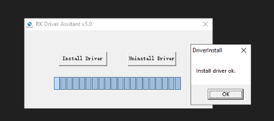
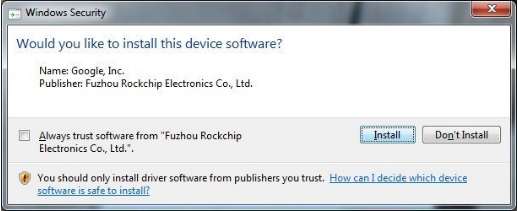
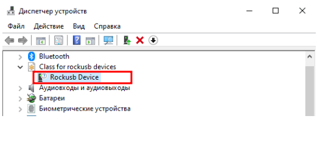
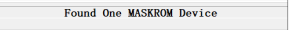
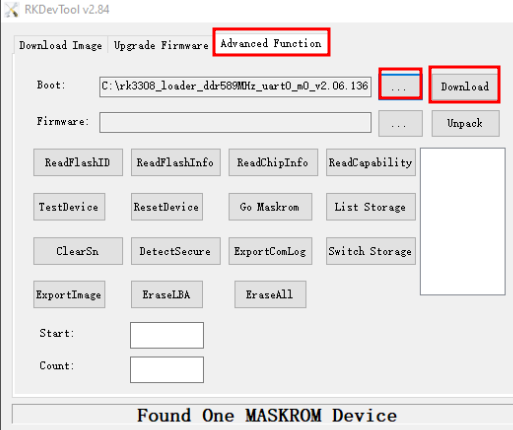
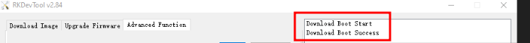
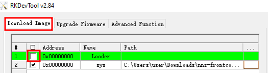
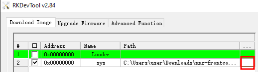
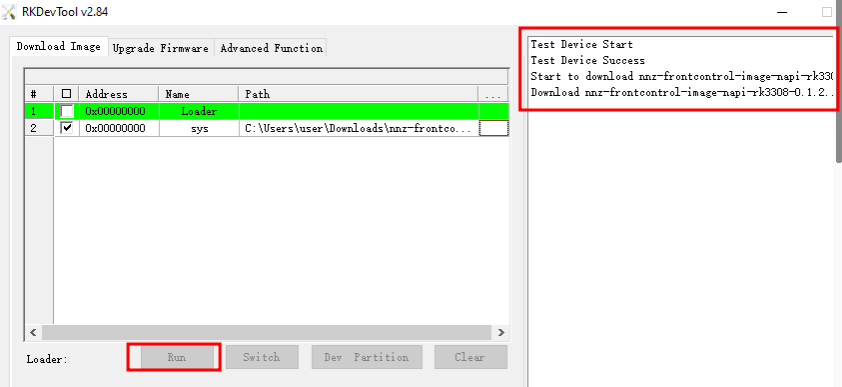

# Прошивка процессорного модуля NAPI из ОС Windows

## Содержание

- [Прошивка процессорного модуля NAPI из ОС Windows](#прошивка-процессорного-модуля-napi-из-ос-windows)
  - [Содержание](#содержание)
  - [Драйверы для работы](#драйверы-для-работы)
  - [Loader и прошивки для устройств NAPI](#loader-и-прошивки-для-устройств-napi)
  - [ШАГ 1. Установка драйвера rockusb](#шаг-1-установка-драйвера-rockusb)
  - [ШАГ 2. Загрузка платы в режиме Maskrom](#шаг-2-загрузка-платы-в-режиме-maskrom)
  - [Шаг 4. Прошивка bootloader](#шаг-4-прошивка-bootloader)
  - [Шаг 5. Прошивка образа системы (NapiLinux)](#шаг-5-прошивка-образа-системы-napilinux)
  - [Если что-то пошло не так](#если-что-то-пошло-не-так)
  - [Ссылки](#ссылки)


## Драйверы для работы

Необходимо скачать и установить драйверы для ОС Windows


RKDevTool on Windows : https://wiki.radxa.com/Rock5/install/rockchip-flash-tools. 

(Прямая ссылка https://dl.radxa.com/tools/windows/RKDevTool_Release_v2.96-20221121.rar)

RK Driver Assistant: https://dl.radxa.com/tools/windows/DriverAssitant_v5.0.zip

## Loader и прошивки для устройств NAPI

Необходимо скачать корректный для вашего устройства лоадер и прошивку. Для этого надо знать ревизию процессора (rk3308A или rk3308b).

 - Бутлоадер для NaPi: https://dl.radxa.com/rockpis/images/loader/

Выбор прошивки также зависит от ревизии процессора и от типа устройства, которое вы хотите прошить (процессорный модуль \ сборщик \ токо сборщик).

- Прошивки для всех устойств на основе NaPi (Napilinux): https://packages.nnz-ipc.net/napi/

:boom: Прошивки для процессорного модуля NAPI с процессором rk3308b находится по ссылке: https://packages.nnz-ipc.net/napi/nnz-napi-image/napi-rk3308b-s/

:boom: Прошивки для токо-сборщика с процессором rk3308b находится по ссылке: https://packages.nnz-ipc.net/napi/nnz-frontcontrol-image/napi-rk3308b-s/

## ШАГ 1. Установка драйвера rockusb

- Распаковываем архив DriverAssitant_v5.0.zip
- В папке с распакованными файлами запускаем DriverInstall.exe
- В появившемся окне нажимаем кнопку Install Driver и ждем сообщения «Install driver ok.»
  

  
Может появиться запрос от защиты системы Windows доверять ли данному драйверу. С запросом нужно согласиться.



## ШАГ 2. Загрузка платы в режиме Maskrom

- С помощью кабеля USB Type-C подключаем устройство к ПК в слот USB-A;
- Нажимаем и удерживаем клавишу Maskrom, затем коротко нажимаем клавишу Reset не отпуская Maskrom, через несколько секунд отпускаем Maskrom;

```text
При успешной установке драйверов и правильном подключении в диспетчере устройств должно появиться устройство Rockusb Device в классе устройств Class for rockusb devices.
```


## Шаг 4. Прошивка bootloader

- Распаковываем архив с программой RKDevTool
- Запускаем RKDevTool.exe
```text
Если предыдущие шаги были выполнены верно и Napi подключен к ПК, мы увидим сообщение в нижней части программы: Found One MASKROM Device;
```


- В окне программы переходим во вкладку Advanced Function;
Нажимаем на кнопку «...» в строке Boot:
В появившемся окне указываем путь к нужному файлу bootloader’а, нажимаем кнопку «Открыть»;



Следом нажимаем кнопку «Download», если выбран правильный файл и переход Napi в режим загрузки прошел успешно, то в правой части окна программы отобразится сообщение Download Boot Success;



:boom: Поздравляем, вы "прошили" bootloader, осталось совсем немного - прошить прошивку.

## Шаг 5. Прошивка образа системы (NapiLinux)

- Возвращаемся во вкладку Download Image; 
Убираем(!) чекбокс в первой строке с именем Loader (так как мы уже произвели загрузку bootloader’а в ручном режиме, это исключает ошибки, иногда возникающие в режиме автоматической загрузки);



- Во второй строке с именем sys нажимаем левой кнопкой мыши в области с именем «...», в появившемся окне выбираем нужный образ системы. 



- Нажимаем кнопку Run. Процесс загрузки образа будет отображаться в правой части программы.



При у спешной загрузке отобразиться сообщение Download image OK.
После данного сообщения плату можно перезагрузить и использовать в обычной режиме. 

:boom: Поздравляем, вы успешно прошили NaPi

## Если что-то пошло не так

:boom: Если процесс загрузки завершился с ошибкой, можно попробовать повторно нажать кнопку Run.

:boom: Если во время прошивки произошел разрыв соединения по USB, то шаги нужно повторить с момента подключения платы в режиме Maskrom и загрузки bootloader’а.

## Ссылки

Драйверы и программы для загрузки: https://wiki.radxa.com/Rock5/install/rockchip-flash-tools

Прошивки для NaPi (Napilinux): https://packages.nnz-ipc.net/napi/

Бутлоадер для NaPi: https://dl.radxa.com/rockpis/images/loader/

Описание и прошивка для Linux: https://github.com/dmnovikov/napiguide/blob/main/readmeNapi.md
