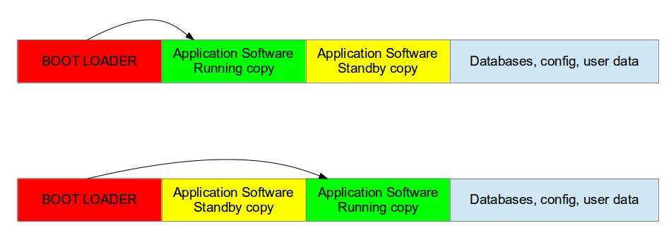

# NapiLinux

## Общие сведения

NapiLinux - дистрибутив для процессорного модуля NAPI на основе чипа RK3308. NapiLinux собирается в среде Yocto из исходных кодов по принципу "ничего лишнего". Благодаря открытой политике вы тоже можете собрать NapiLinux, а также дополнять систему через собственные слои и рецепты Yocto. Мы как команда разработчиков будем рады если NapLinux будет развиваться как по вариантам сборки, так и в плане поддержки других чипов и одноплатников.

NapiLinux оптимизирован для embedded систем и изначально спроектирован с учетом длительной автономной работы, возможностью апдейта системы и откатов. Основное отличительное свой свойство NapiLinux от классических дистрибутивов (Debian, Ubuntu, DietPi) -дублирующие друг друга разделы с системой и отдельный раздел с пользовательскими данными. 


|partition      | size                  |ro\rw|
|---------------|-----------------------|-----|
|/dev/mmcblk1p1 | 1.5G Linux filesystem | ro  |
|/dev/mmcblk1p2 | 1.5G Linux filesystem | not mounted  |
|/dev/mmcblk1p3 |  1G  Linux filesystem| rw |





Система может грузиться как с раздела 1 (/dev/mmcblk1p1) так и с раздела 2 (/dev/mmcblk1p2). При апдейте системы обновляется один из разделов (более "старый"). Если обновление прошло неудачно, система загрузится с другого раздела. Раздел 3 (/dev/mmcblk1p3) с пользовательскими данными содержит все конфиги, пользовательские файлы, базы данных и так далее. Чтобы сделать бекап, не нужно копировать всю систему, достаточно сделать бекап этого раздела. Чтобы "обнулить" систему достаточно стереть все данные этого раздела. 

## Доступ к системе

### Доступ через порт консоли

Консоль используется для отладки или для первоначального запуска через TTL-USB устройство

```text
Порт: /dev/ttyS0
Параметры порта: 115200,8,n,1
(в старых прошивках возможен вариант 1500000,8,n,1 )
```

:boom: Для доступа к консоли с компьютера понадобиться любой USB-UART преобразователь. Например, CP2102.

#### Доступ через Ethernet

При старте системы, сетевая подсистема пытается получить IP-адрес по протоколу DHCP. Если система "видит" DHCP сервер, то она получает IP адрес (маску, шлюз, DNS) и по выданному адресу можно получить доступ к системе через ssh.

Если адрес не получен, система назначает адрес по умолчанию. 

```bash
inet 169.254.100.100  netmask 255.255.0.0  broadcast 169.254.255.255
```
Нужно установить на хост адрес из сети 169.254.100.0/24 (например 169.254.100.99 mask 255.255.255.0) и зайти по этому адресу через ssh или через броузер по адресу http://169.254.100.100:8081 и далее выставить параметры сети в ручную.

### Сетевые параметры

Статический IP адрес через Веб


Статический IP адрес через ssh

```bash
root@napi-rk3308b-s:~# cat /etc/systemd/network/20-wired.network
[Match]
Name=end0

[Network]
Address=10.20.30.150/24
Gateway=10.20.30.1
DNS=10.20.30.1


```

Динамический IP адрес через Веб


Динамический IP адрес через ssh

```bash

root@napi-rk3308b-s:~# cat /etc/systemd/network/20-wired.network
[Match]
Name=end0

[Network]
DHCP=ipv4
LinkLocalAddressing=ipv4
IPv6AcceptRA=no
IPv4LLStartAddress=169.254.100.100

[DHCP]
RouteMetric=10
ClientIdentifier=mac

```
## Состав минимальной системы


|компонента      | версия                  |
|---------------|-----------------------|
|kernel | 6.3.0 |
|uboot|2023.04|
|swupdate|2023.05|
|busybox|1.35|

:boom: оболочка: bash

## Состав системы в расширенном варианте 

|компонента      | версия                  |
|---------------|-----------------------|
|python3|3.10.9|
|python3-flask|2.1.1|
|telegraf|1.24.2-r1|
|modpoll|1.0.0|
|modemmanager|1.18.8|
|mosquitto|2.0.14|
|grafana|9.3.6|

## Инструкция по сборке

... в процессе ...


