NAPI руководство пользователя
===========================================

 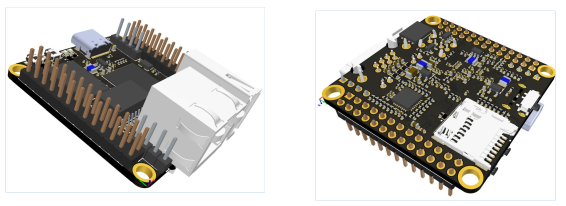

# Содержание

- [NAPI руководство пользователя](#napi-руководство-пользователя)
- [Содержание](#содержание)
- [Основные характеристики](#основные-характеристики)
- [NAPI GPIO](#napi-gpio)
- [Инсталляция Linux на SD](#инсталляция-linux-на-sd)
- [Работа c NAPI через TTL-USB консоль](#работа-c-napi-через-ttl-usb-консоль)
  - [Получение доступ к управлению NAPI c Linux-хоста](#получение-доступ-к-управлению-napi-c-linux-хоста)
  - [Получение доступ к управлению NAPI c Windows-хоста](#получение-доступ-к-управлению-napi-c-windows-хоста)
  - [Получение доступ к управлению NAPI по сети через SSH](#получение-доступ-к-управлению-napi-по-сети-через-ssh)
  - [Инсталяция Linux в память NAND](#инсталяция-linux-в-память-nand)
- [Быстрые ссылки](#быстрые-ссылки)
- [Лицензии и права](#лицензии-и-права)
  
# Основные характеристики

- RK3308 processor (Cortex- A35 quard core)
- NAPI Linux \ Ubuntu 20.04 \Debian 10 \ Yocto Linux (kernel 4.4)
- 512Мб ОЗУ
- 4Гб ПЗУ (NAND)
- 1хEthernet 100Мбит
- 2xUSB 2.0
- Питание +5В (через GPIO или USB Type-C)
- POE Ready
- 2.4мм GPIO 
- :point_up: Компактный размер: 43х43 мм
  


# NAPI GPIO

:warning: Внимание, несмотря на "похожесть" с Rockpi S, GPIO отличаются

 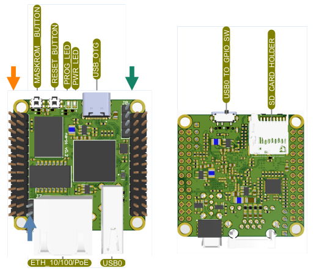

 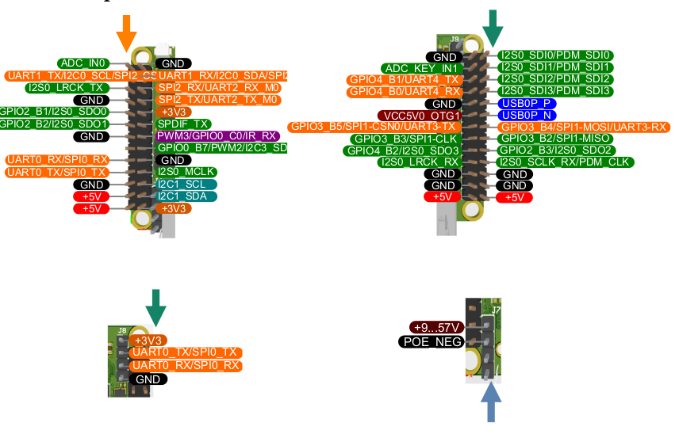


# Инсталляция Linux на SD

:warning: Подходит любая microSD карта от 8Gb

<br>

 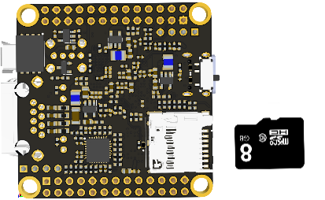


Записть прошивки на SD

:point_up: Адрес прошивок: (https://packages.nnz-ipc.net/napi/)

:point_up: Адрес программы Balena для записи SD: (https://balena-etcher.com)

:point_up: Адреса других ОС с сайта RADXA: (https://wiki.radxa.com/RockpiS/downloads)

В программе Balena надо зашить на SD скачанный образ NAPI Linux

 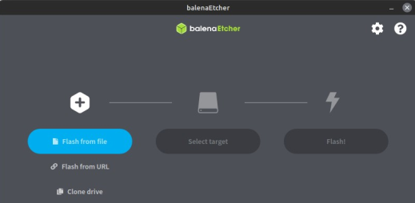
 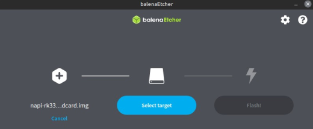
 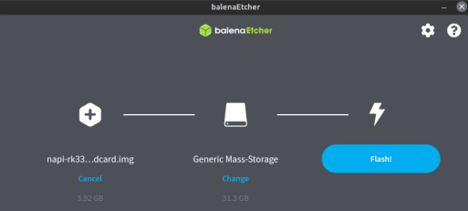
 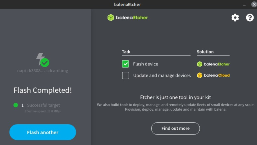

:point_up: Вы можете работать с SD карты, без записи образа в NAND. При этом в "боевом" режиме рекомендуется работать с NAND

# Работа c NAPI через TTL-USB консоль 

:point_up: Работает с любой прошивкой

 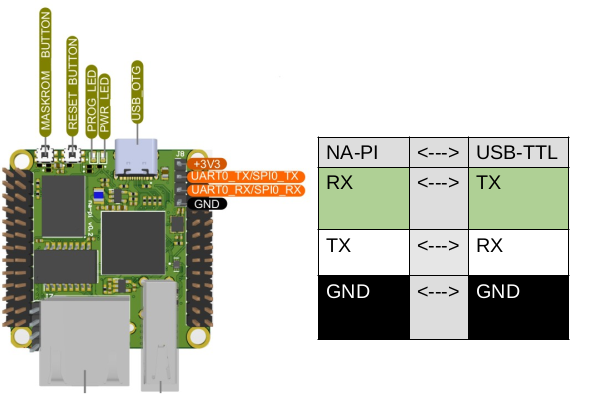

 ``` 

Параметры связи порта:

baudrate: 1500000
data bit: 8
stop bit: 1
parity: none
flow control: none

```

 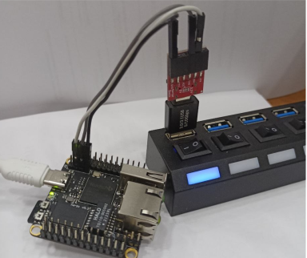

## Получение доступ к управлению NAPI c Linux-хоста
<br>

- Устанавливаем программу minicom:
```
sudo apt-get update
sudo apt-get install minicom
```

 - Определяем название USB-TTL в системе. Как правило, это будет устройство /dev/ttyUSB0(1) или /dev/ttyACM0(1). Чтобы точно узнать какое устройство, можно воспользоваться командой  
  ```dmesg | tail``` 

 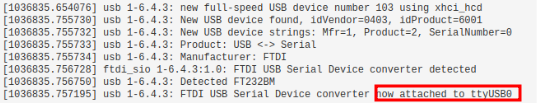

- Открываем консоль и получаем доступ к командной строке NAPI 

  ``` sudo minicom -D /dev/ttyUSB0 -b 1500000 ```

Вы должны увидеть лог загруки ядра и приглашение в ввести логин\пароль

``` 
login: root
password: napilinux *)

*) зависит от дистрибутива 
```

:boom: Необходимо сменить пароль командой ```passwd root```

 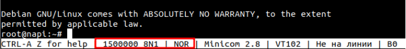

## Получение доступ к управлению NAPI c Windows-хоста
<br>

- Скачиваем и устанавливаем программу Putty ( https://putty.org.ru )
- Подключаем преобразователь USB-TTL к ПК
- В "Диспетчере устройств" определяем номер порта (USB Serial Port - COM3)
- Проверяем параметры Putty
```  
Serial line — COM3;
Speed — 1 500 000;
Connection type — Serial;
Saved Sessions — NA-PI
```
 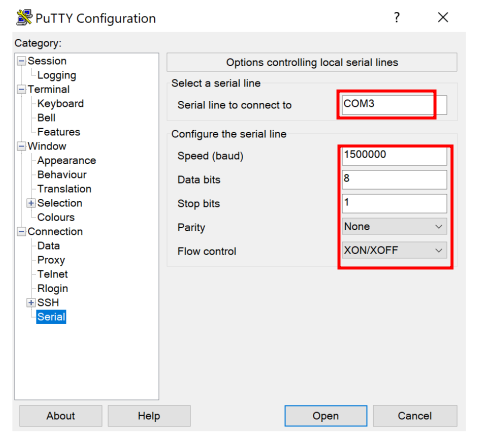

## Получение доступ к управлению NAPI по сети через SSH

По умолчанию на устройстве настроено автополучние IP-адреса по
DHCP. 

:point_up: Для определения IP-адреса NAPI можно использовать программы сканирования сети (Linux — Angry IP Scanner (https://angryip.org)/ Windows — Advanced IP Scanner (https://advanced-ip-scanner.com)


```
ssh root@<ip адрес NAPI>
```

## Инсталяция Linux в память NAND
<br>

:point_up: Рекомендуем именно этот режим в длительной работе !

1.  Устанавливаем на Хост-ПК (Linux) утилиту rkdeveloptool.
В теримнале вводим команду для установки зависимостей сборки:
```
sudo apt-get install libudev-dev libusb-1.0-0-dev
dh-autoreconf
```

2.  Копируем исходный код и собираем rkdeveloptool

```  
git clone https://github.com/rockchip-linux/rkdeveloptool
cd rkdeveloptool
autoreconf -i
./configure
make
```

3. Копируем собранную программу в директорию с программами
```
sudo cp rkdeveloptool /usr/local/bin/
```

:warning: Перед записью образа во внутреннюю память, SD Card должна быть
извлечена

4. Загружаем плату в режиме Maskrom;

    - c помощью кабеля USB Type-C подключаем устройство к ПК в слот USB-A;

    - нажимаем и удерживаем клавишу Maskrom, затем коротко нажимаем клавишу Reset не отпускаем Maskrom, через несколько секунд отпускаем Maskrom;

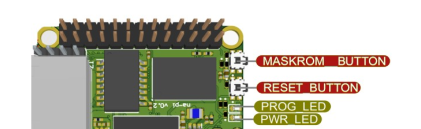

5.  Открываем терминал на Хост-ПК, вводим команду lsusb , если в списке USB-устройств появится ```«ID 2207 : 330e»``` -  означает, что устройство определилось в системе;

6. В терминале вводим команду ```rkdeveloptool ld``` , если плата
находится в режиме Maskкom, на экране появится сообщение 
```
dmn@hp:~/rkdeveloptool$ ./rkdeveloptool ld
DevNo=1	Vid=0x2207,Pid=0x330e,LocationID=101	Maskrom
dmn@hp:~/rkdeveloptool$

```

7. Скачиваем bootloader (https://dl.radxa.com/rockpis/images/loader/)  файл ```rk3308_loader_ddr589MHz_uart0_m0_v2.06.136sd.bin``` и загружаем во внутреннюю память 
  
```
sudo rkdeveloptool db /path/to/rk3308_loader_ddr589MHz_uart0_m0_v2.06.136sd.bin

```

8. скачиваем образ системы (https://packages.nnz-ipc.net/napi/) и загружаем во
внутреннюю память соответсвующий вашей конфигурации образ:

```
sudo rkdeveloptool db rk3308_loader_ddr589MHz_uart0_m0_v2.06.136sd.bin
```

:boom:При успешной загрузке прошивки через некоторое время замигает
красный индикатор.

9. Если необходимо очистить внутреннюю память от загруженного
образа

    - Создаем пустой образ, вводя команду: ```dd if=/dev/zero of=./zero.img bs=4M count=10```
    - Запускаем плату в режиме Maskrom
    - Загружаем bootloader
    - Загружаем полученный образ ```rkdeveloptool wl 0 zero.img ```
    - Перезагружаем устройство


# Быстрые ссылки

- [NAPI images](https://packages.nnz-ipc.net/napi/)

- [Rockpi S images (совместимы с NAPI)](https://wiki.radxa.com/RockpiS/downloads)


# Лицензии и права ###

- NAPI и NAPI Linux разработка ООО "Коминтех" для ООО "Ниеншанц-Автоматика